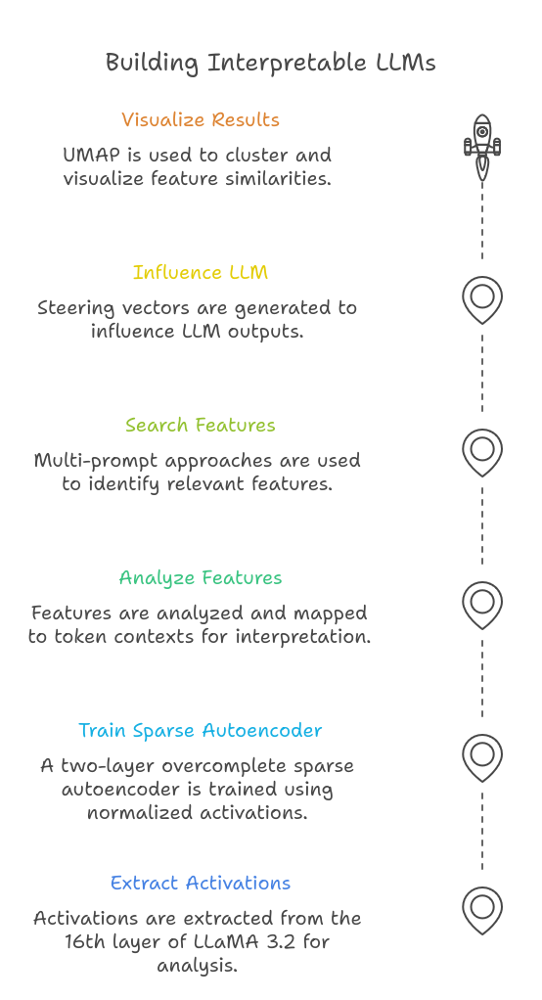
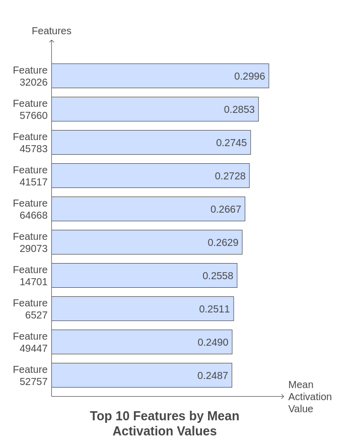
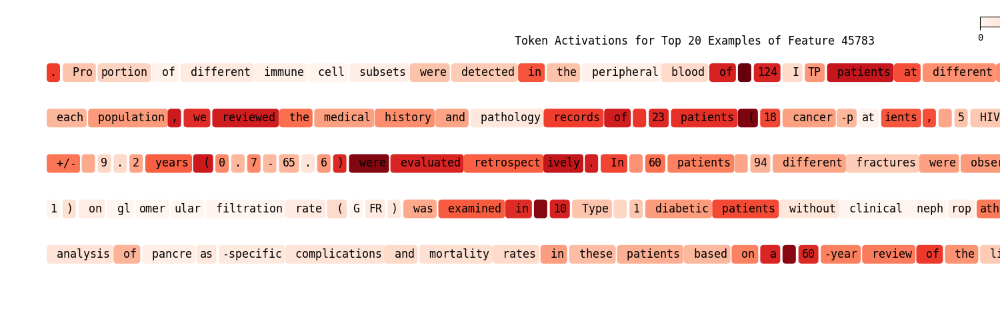
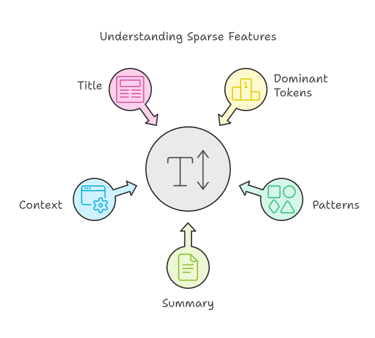
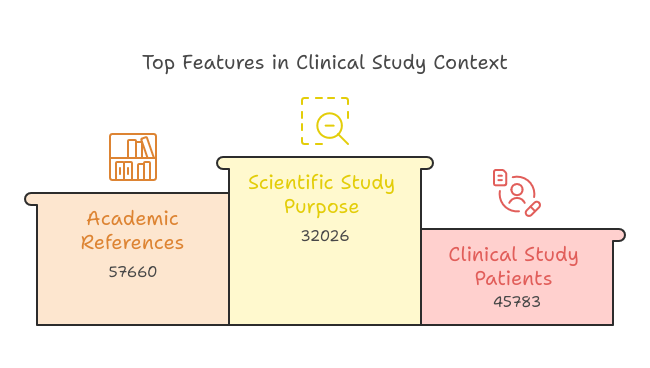

# Scaling Monosemanticity with LLaMA

This repository reproduces and extends the work from the article [Scaling Monosemanticity: Extracting Interpretable Features from Claude 3 Sonnet](https://transformer-circuits.pub/2024/scaling-monosemanticity/index.html), applying the methods to LLaMA 3.2-3B. The project explores monosemantic neurons in large language models, investigates their scaling behavior, and implements sparse autoencoders to extract interpretable features.

---

## Features

- **Extracting Activations**: Analyze token-level activations from the 16th layer of LLaMA 3.2 (3B, 16-bit quantized) using the Pile dataset.
- **Sparse Autoencoder (SAE)**: Train an overcomplete SAE (3072-65536-3072) to uncover interpretable features in the latent space.
- **Feature Search**: Identify features relevant to specific topics using multi-prompt inputs and activation metrics.
- **Influencing Outputs**: Use steering vectors derived from the SAE to influence LLaMA’s output during inference.





---

## Examples and Results

### Prompt Search
Example prompts used for finding relevant features:
```plaintext
1. program on aerobic capacity and muscle strength of adults with hearing loss. Twenty-three adults with hearing loss were separated into 2 groups. Thirteen subjects
2. the effect of a traditional dance training program on aerobic capacity and muscle strength of adults with hearing loss. Twenty-three adults with hearing loss were separated into
3. been examined comprehensively. Peritoneal lavage was performed in 351 patients before curative resection of a gastric carcinoma between 1987 and
```

---

### Feature Retrieval



---

### Top 5 Examples for Feature 45783
Printing 5 examples from the dataset with the highest activation values:


(click to see full size image)

---

### Automatic Feature Explanation

We put the examples from above into ChatGPT4 to generate a description for the feature, and it gives us 5 pieces of information.


**Example: Feature Index [45783]**
- **Dominant Tokens**: `'patients'`, `'('`, `'Fifty'`, `';'`, `'into'`
- **Patterns**: Activates in medical or clinical study contexts, often quantifying patients or describing study methodologies.
- **Summary**: Highlights patient-focused data or study details in medical literature.
- **Context**: Found in detailed descriptions of clinical trials or patient demographics.
- **Title**: **Clinical Study Patients**




Top Features and their Titles:
1. **Feature 32026**: Scientific Study Purpose  
2. **Feature 57660**: Academic References  
3. **Feature 45783**: Clinical Study Patients  
4. **Feature 41517**: Experiment Validation  
5. **Feature 64668**: Action and Roles  
6. **Feature 29073**: Conversational Context  
7. **Feature 14701**: Quantitative Demographics  
8. **Feature 6527**: Population Studies  
9. **Feature 49447**: Technical Problem-Solving  
10. **Feature 52757**: Medical Study Terms  


---

### Influence
Influencing LLaMA’s outputs during inference using the starting prompt:
```plaintext
I am a 
```

1. **Zero Boost**:
   ```plaintext
   I am a little confused about the meaning of the word 'sociology' in the title of this book. I have read the book and I am not sure what the word 's
   ```

2. **30x Boost on Feature 45783**:
   ```plaintext
   I am a 20 year old female who has been diagnosed with a rare disease called SLE (systemic lupus erythematosus) and have been diagnosed with 3 cases of pulmonary
   ```
